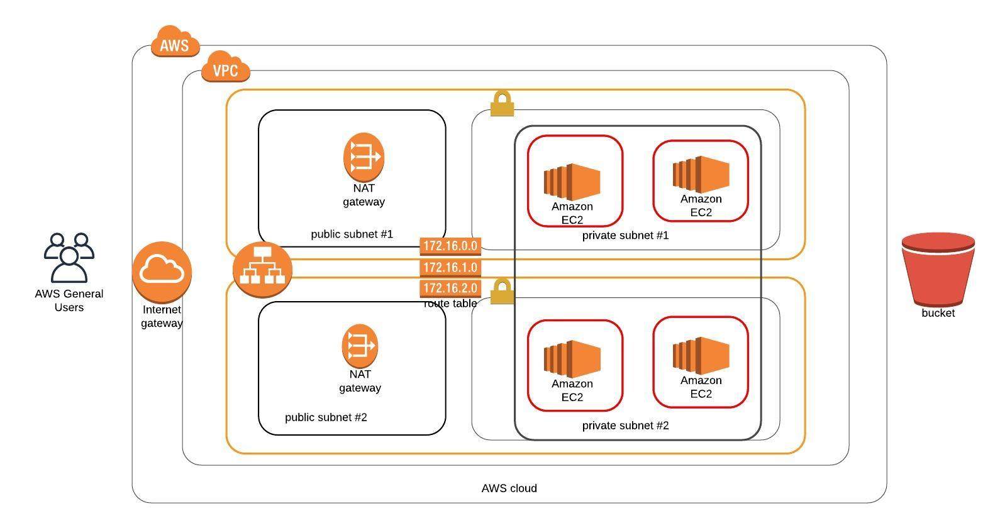

# Udagram project
--------
Creating this project will give you the hands-on experience you need to confidently talk about i
nfrastructure as code. So, for that reason, we have chosen a realistic scenario where you deploy an application
(Apache Web Server) and you also pick up code (JavaScript and HTML) from S3 Storage and deploy it in the appropriate 
folder on the web server.

There will be two parts to this project:
* You'll first develop a diagram that you can present as part of your portfolio and as a visual aid to understand the
   CloudFormation script.
   
* The second part is to interpret the instructions as well as your own diagram and create a matching CloudFormation script.

----------

---------

## Run the below commands to create the full stack : 
---------
`./create.sh networking-stack networking.yaml networking-parameters.json` 
`./create.sh servers-stack servers.yaml servers-parameters.json`
---------

* The bucket is already created, and the IAM role for the EC2 instances allows it to download
    (using aws cli) the udagram.zip file and unzip it at /var/www/html location.
    
* The application URL will be an output of the servers-stack. [click here](http://serve-webap-mgqzv1uguh2h-586621031.us-west-2.elb.amazonaws.com/)

